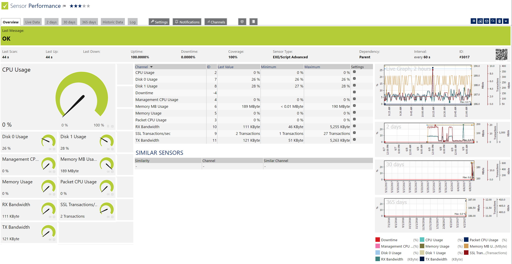

# PRTG-NetScaler

A collection of PRTG scripts to monitor key metrics and status of NetScaler health.

This sensor library relies on the [NetScaler PowerShell module](https://www.powershellgallery.com/packages/NetScaler) written by Brandon Olin.

## Included Scripts
- NetScaler-AppliancePerformance.ps1 - Monitor general NetScaler perfomance stats.
	- CPU utlization
	- Packet engine CPU utilization
	- Management engine CPU utilization
	- Disk usage
	- Memory usage
	- Network throughput (RX/TX)
	- SSL transactions per second
- NetScaler-AllvServer-State.ps1 - Monitor state and health of all instances of all vServer types.
	- Health % for each vServer
	- State (Up, down, maint) for each vServer
	- Note: includes Load Balancing, AAA, VPN (Gateway) and Content Switch vServers
- NetScaler-LBvServer-State.ps1 - Monitor state and health of all instances of Load Balancer vServers.
	- Health % for each vServer
	- State (Up, down, maint) for each vServer
- NetScaler-CertExpiration.ps1 - Monitor days until expiration for all SSL server certificates.
	- Days until next certificate expiration date
	- Days until expiration for each server type certificate
- NetScaler-ConfigSavedState.ps1 - Monitor for unsaved configuration changes.
	- Unsaved configuration change status
	- Time since changes were saved

## Configuration
1) On the PRTG Server open a Powershell (x86) prompt as admin and run: 
	- Install-Module -Name NetScaler -scope AllUsers
	- Set-ExecutionPolicy Unrestricted
	- Note:  This MUST be done in the (x86) version of powershell
2) Create a user on the NetScaler with the read-only Command Policy
3) Copy all .ps1 files to C:\Program Files (x86)\PRTG Network Monitor\Custom Sensors\EXEXML
	- Directory may vary with PRTG install path
4) Copy all .ovl files to C:\Program Files (x86)\PRTG Network Monitor\lookups\custom
	- Directory may vary with PRTG install path
5) In PRTG go to Setup > Administrative tools:
	- Reload lookups
	- Restart core server (optional, run if PRTG has issues finding the script)
6) Add a NetScaler device in PRTG.  Set the hostname or IP to the NSIP address.
7) Edit your NetScaler device in PRTG and set the Linux credentials to the new read only account
8) Add a new EXE/Script Advanced type sensor to your NetScaler device
9) Set the following options on the sensor
	- Name - Set a descriptive name
	- EXE/Script - Choose the desired script
	- Parameters - Enter: %host %linuxuser %linuxpassword
10) Select continue

## Screenshots

